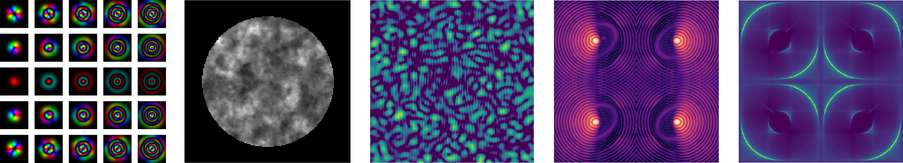

HCIPy: High Contrast Imaging for Python
=======================================

HCIPy is a framework written in Python for high contrast imaging simulation work. It implements adaptive optics simulation, coronagraphy and optical diffraction calculations. This page contains the HCIPy documentation.

The banner above shows a number of simulations done with HCIPy. From left to right: Gaussian-Laguerre modes plotted in combined phase-amplitude images, a pupil-plane image showing atmospheric scintillation, a focal-plane image of speckles for a self-coherent camera with a charge 4 vortex coronagraph, a focal-plane image of a circumstellar disk in polarization with a broadband vector apodizing phase plate coronagraph, and an image for a Pyramid wavefront sensor. Please visit the :doc:`tutorials<tutorials/index>` for more examples of what HCIPy can do.

.. toctree::
   :maxdepth: 1
   :caption: Getting Started

   installation
   getting_started/index
   tutorials/index
   citing
   team
   changelog

.. toctree::
   :maxdepth: 1
   :caption: HCIPy Package

   modules/aperture
   modules/atmosphere
   modules/config
   modules/coronagraphy
   modules/field
   modules/fourier
   modules/interpolation
   modules/metrics
   modules/mode_basis
   modules/optics
   modules/plotting
   modules/propagation
   modules/util
   modules/wavefront_control
   modules/wavefront_sensing

.. toctree::
   :maxdepth: 1
   :caption: Developer resources

   development/contributing_guide
   development/project_setup
   development/new_release
